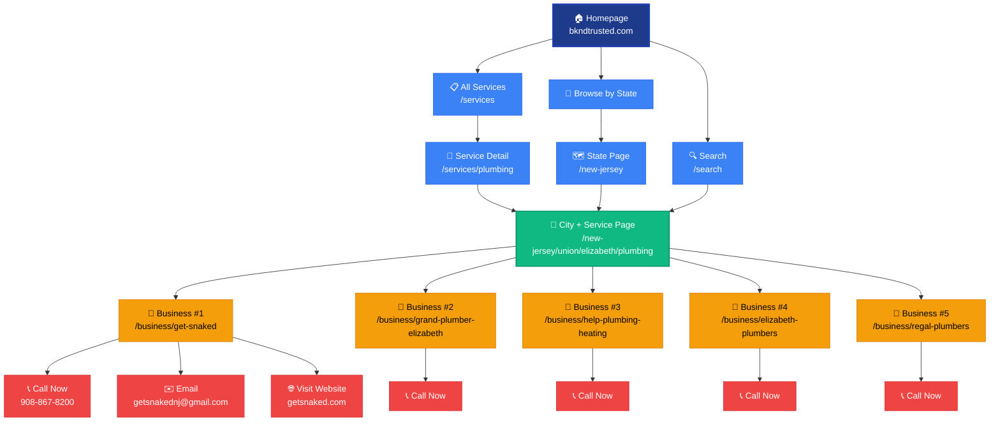
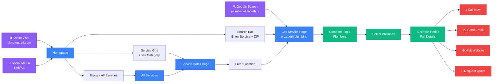
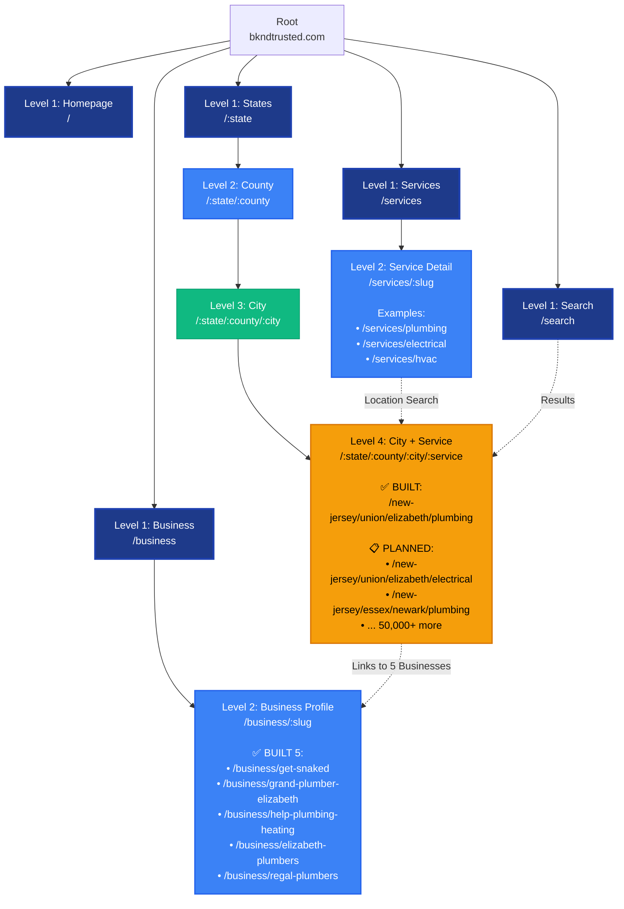
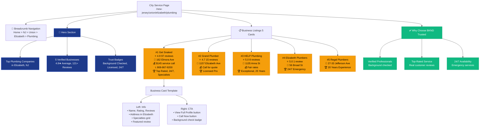
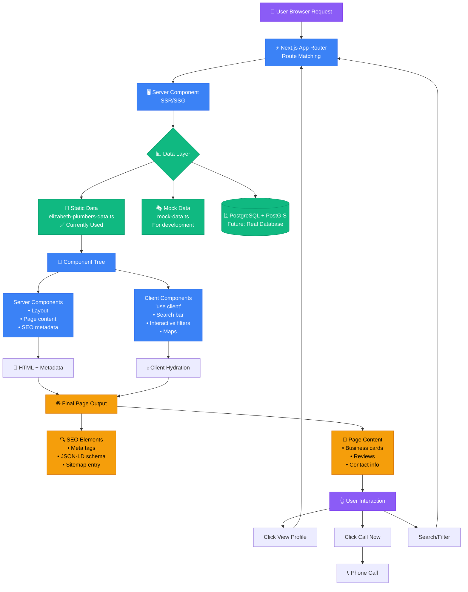
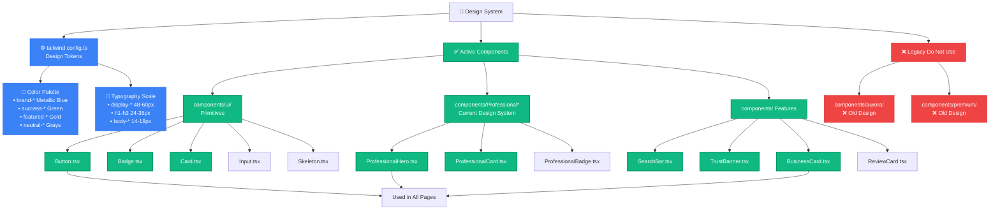
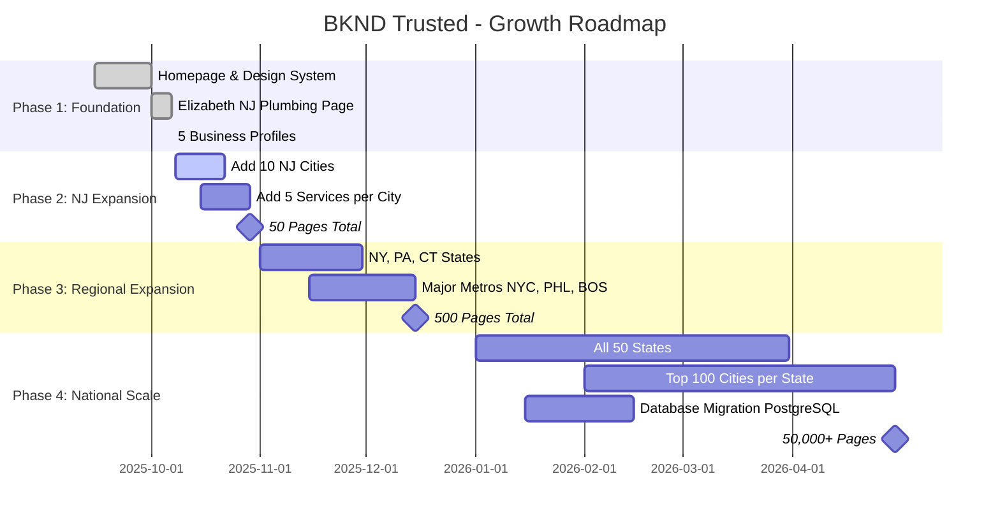

# BKND Trusted - Visual Site Flowchart

## 🗺️ Interactive Site Map (Mermaid Diagram)

---

## 📊 User Journey Flowchart

---

## 🏗️ Page Hierarchy Structure

---

## 🎯 Business Profile Page Structure

```mermaid
graph TD
    PROFILE[Business Profile Page<br/>/business/get-snaked]

    %% Header Section
    PROFILE --> HEADER[📌 Header Section]
    HEADER --> H1[Business Name]
    HEADER --> H2[⭐ Rating: 4.9 97 reviews]
    HEADER --> H3[🏆 Badges: Top Rated, 24/7, Licensed]

    %% Main Content
    PROFILE --> MAIN[📄 Main Content Area]
    MAIN --> M1[About Section<br/>Business description]
    MAIN --> M2[Services Offered<br/>6 specialties grid]
    MAIN --> M3[Customer Reviews<br/>3 testimonials with avatars]
    MAIN --> M4[Service Area<br/>Elizabeth, NJ + surrounding]

    %% Sidebar
    PROFILE --> SIDEBAR[📋 Sticky Sidebar]
    SIDEBAR --> S1[💰 Pricing<br/>$145 service call]
    SIDEBAR --> S2[📞 Call Now Button<br/>908-867-8200]
    SIDEBAR --> S3[🕐 Business Hours<br/>Open 24 hours]
    SIDEBAR --> S4[✅ Background Check Badge]

    %% Footer Section
    PROFILE --> FOOTER[📝 Contact Info Section]
    FOOTER --> F1[📞 Phone: 908-867-8200]
    FOOTER --> F2[✉️ Email: getsnakednj@gmail.com]
    FOOTER --> F3[🌐 Website: getsnaked.com]
    FOOTER --> F4[📍 Address: 162 Elmora Ave]

    %% Additional Info
    PROFILE --> EXTRA[🎓 Credentials & Info]
    EXTRA --> E1[📜 Licenses<br/>Licensed drain specialist]
    EXTRA --> E2[🏆 Certifications<br/>Video inspection certified]
    EXTRA --> E3[💳 Payment Methods<br/>Cash, Credit, Debit]
    EXTRA --> E4[📱 Social Media<br/>Facebook, Instagram]

    %% Styling
    classDef main fill:#3B82F6,stroke:#2563EB,color:#fff
    classDef sidebar fill:#10B981,stroke:#059669,color:#fff
    classDef footer fill:#F59E0B,stroke:#D97706,color:#000

    class HEADER,MAIN main
    class SIDEBAR sidebar
    class FOOTER,EXTRA footer
```

---

## 📍 City Service Page Structure (Elizabeth Plumbing Example)

---

## 🔄 Data Flow Architecture

---

## 🎨 Component Hierarchy (Design System)

---

## 🚀 Scalability Roadmap

---

**Color Legend:**
- 🔵 **Blue** = Main pages / Core features
- 🟢 **Green** = City service pages / Active content
- 🟡 **Orange** = Business profiles / Conversion points
- 🔴 **Red** = Call-to-action / Conversion events
- 🟣 **Purple** = Entry points / Traffic sources

---

*Flowchart Version: 1.0 | Generated: October 7, 2025*
